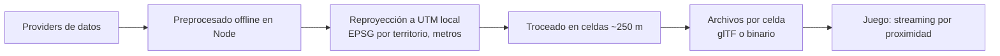

# URBS — motor de sandbox urbano sobre mapas reales

Contexto del proyecto para Claude Code. Léelo antes de trabajar en el repo.

## Concepto

URBS es un **motor** que genera ciudades jugables en navegador a partir de datos geográficos abiertos, **nunca de Google Maps**. La ciudad es un dato de entrada, no código: el mismo pipeline debe poder generar cualquier territorio del mundo.

Encima del motor se monta un juego de mundo abierto tipo sandbox urbano: conducción libre, misiones y tráfico con IA. Las misiones se basan en lugares reales (POIs de OSM), por ejemplo "lleva esto al Mercado de San Agustín".

**Regla fundacional**: el core nunca sabe de qué país ni de qué ciudad come. Nada puede estar codificado para una zona concreta.

## Nombre

- **URBS** — nombre del motor. *urbs* = "la ciudad" en latín, sin decir cuál. Expansión: **UR**ban **R**eal-world **B**lock **S**andbox.
- Paquetes: `urbs-core`, `urbs-pipeline`, `urbs-providers`.
- **SBA** ("Sand Box Auto") — codename interno y de broma. No usar en nada público: imita la forma de "Grand Theft Auto" y ahí hay marca de Rockstar/Take-Two.
- "GTA" y "Marineda" quedan descartados como nombre. Marineda ataba el proyecto a A Coruña; "Auto" lo ataba a la conducción. El motor no se nombra por su primer demo.
- El nombre del juego que se construya encima puede ser distinto del nombre del motor (modelo Unreal / Fortnite).

## Convenciones de código

- JavaScript vanilla, sin frameworks de UI.
- Estructura limpia y organizada (DDD, separación clara de dominios, buenas prácticas).
- Render con three.js y física con Rapier (WASM).
- Las librerías externas se cargan con versión fija.
- **Preprocesado en Node** (decidido). Motivo: el ecosistema geoespacial en JS cubre el pipeline completo (`turf`, `proj4`, `gdal-async`, parsers de `.pbf`, exportadores glTF) y comparte lenguaje y estructuras de datos con el runtime de three.js, evitando una capa de traducción.

## Ámbito geográfico

- **Vertical slice inicial**: Ciudad Vieja, Pescadería y Orzán (1–2 km²).
- **Segundo objetivo**: A Coruña, Oleiros, Culleredo y Arteixo (más de 200 km², decenas de miles de edificios).
- **Objetivo del motor**: cualquier territorio con cobertura OSM.

Escalar consiste en darle más datos al mismo pipeline, nunca en tocar el core.

## Arquitectura de providers

Solo OSM tiene cobertura global. Catastro INSPIRE y PNOA/IGN son exclusivos de España. Por eso el pipeline consume **providers intercambiables** con degradación en cascada: el core pide "dame edificios de esta área" y el provider resuelve con lo mejor disponible en ese territorio.

| Capa | Provider España | Fallback global | Degradación |
| :---- | :---- | :---- | :---- |
| Huellas de edificio | Catastro INSPIRE (BU) | OSM `building` | Menos cobertura y sin partes volumétricas |
| Altura y plantas | Catastro (plantas por parte, altura estimada) | OSM `height` / `building:levels` | Si faltan, estimar por uso y contexto |
| Uso dominante | Catastro | OSM `building` + POIs | Menos granularidad |
| Grafo de calles | OSM | OSM | Sin degradación (fuente única) |
| Relieve | MDT LiDAR PNOA 0,5 m | Copernicus DEM GLO-30 (30 m) | Mucha menos resolución |
| Suelo / ortofoto | PNOA 25 cm | No hay equivalente global libre a esa resolución | Texturas procedurales o material genérico |

Los tres últimos casos son reales y conocidos: fuera de España no existe ortofoto libre de 25 cm con cobertura uniforme. El motor debe funcionar sin ella, no asumirla.

## Fuentes de datos

| Fuente | Aporta | Formato / acceso | Cobertura |
| :---- | :---- | :---- | :---- |
| Catastro INSPIRE (edificios, BU) | Huellas, volumetría por partes con número de plantas y alturas estimadas, uso dominante | GML; ATOM por municipio o WFS | España |
| OpenStreetMap | Grafo de calles, tipo de vía, `lanes`, `width`, POIs, edificios | Extracto regional de Geofabrik (.pbf) u Overpass | Global |
| IGN / PNOA | Ortofoto de 25 cm (suelo) y MDT LiDAR de 0,5 m (relieve) | GeoTIFF / COG, Centro de Descargas del CNIG | España |
| Copernicus DEM | Relieve global de 30 m | GeoTIFF | Global |
| ambientCG / Poly Haven | Texturas | CC0 | — |

Ancho de las calles: se usa `width` si existe; si no, se estima a partir de `lanes` o del tipo de vía (`highway`).

Enlaces:

- https://www.catastro.hacienda.gob.es/webinspire/index.html
- https://centrodedescargas.cnig.es/CentroDescargas/home
- https://pnoa.ign.es/pnoa-lidar/productos-a-descarga

## Licencias y atribuciones (obligatorio)

| Fuente | Licencia | Obligación |
| :---- | :---- | :---- |
| Catastro | Licencia de uso de la D.G. del Catastro | Citar la fuente (pendiente: leer la licencia completa antes de publicar o monetizar) |
| OpenStreetMap | ODbL | "© colaboradores de OpenStreetMap". El share-alike solo afecta a la base de datos modificada si se redistribuye |
| IGN / PNOA | CC BY 4.0 (uso comercial permitido) | "Obra derivada de PNOA CC-BY scne.es" |
| Copernicus DEM | Licencia Copernicus (uso libre con atribución) | Citar la fuente |
| Texturas CC0 | Dominio público | Ninguna |

El juego debe incluir una pantalla de créditos con estas atribuciones. Cada provider declara sus atribuciones y el motor las agrega automáticamente según los providers activos en la generación.

**Prohibido**: la geometría o los tiles de Google Maps, las imágenes de Street View y los Photorealistic 3D Tiles. Motivos: sus términos de uso, el coste y que su malla no tiene semántica.

## Riesgos legales

- No usar el nombre, el logo ni la estética de GTA (marca de Rockstar/Take-Two). Esto incluye nombres que imiten su forma, como "Sand Box Auto" en público.
- No incluir marcas reales (tiendas, bancos, coches). Usar marcas inventadas.
- Edificios emblemáticos: preferir modelos estilizados. La Torre de Hércules no da problemas.

## Arquitectura

1. **Providers**: resuelven edificios, calles, relieve y suelo para un área, con degradación según cobertura.
2. **Preprocesado offline** (Node): descarga, reproyecta a la zona UTM que corresponda al territorio y trocea en celdas de unos 250 m. Para A Coruña la zona es UTM 29N (ETRS89, EPSG:25829), nativa de Catastro y PNOA — pero la zona es un parámetro del territorio, no una constante del código.
3. **Celdas**: cada una contiene edificios extruidos, calles y terreno.
4. **Juego**: three.js carga y descarga celdas según la posición del jugador. Rapier se encarga de las colisiones. El tráfico con IA y el pathfinding usan el grafo de OSM.

## Fachadas y estilo visual

- Generación procedural según el número de plantas y el uso que devuelva el provider.
- Módulos de un atlas de texturas: ventana, balcón, portal y escaparate.
- El bajo comercial lleva escaparates; el residencial, balcones.
- Volúmenes: bajo, entreplanta y ático retranqueado, a partir de las partes del edificio.
- Estética local: parametrizable por territorio. Para A Coruña, galerías blancas, granito y pizarra.
- Suelo con ortofoto y relieve con modelo digital del terreno, según lo que aporte el provider.

## Decisiones cerradas

- [x] Lenguaje del preprocesado: **Node**
- [x] Nombre del motor: **URBS** (codename interno: SBA)
- [x] El proyecto es un motor agnóstico del lugar, no un juego de una ciudad

## Decisiones pendientes

- [ ] Estilo visual: realista o low-poly
- [ ] Leer la licencia del Catastro al completo

## Próximos pasos

- [ ] Inicializar el repo (git) y el esqueleto de paquetes: `urbs-core`, `urbs-pipeline`, `urbs-providers`
- [ ] Definir la interfaz de provider antes de escribir ningún provider concreto
- [ ] Descargar el Catastro y OSM de la zona Ciudad Vieja–Pescadería–Orzán
- [ ] Script de preprocesado: reproyección y generación de celdas
- [ ] Prueba de concepto: manzanas extruidas en three.js
