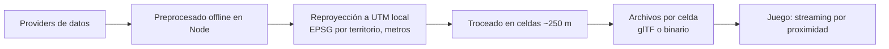

# URBS — motor de sandbox urbano sobre mapas reales

Contexto del proyecto para Claude Code. Léelo antes de trabajar en el repo.

## Concepto

URBS es un **motor** que genera ciudades jugables en navegador a partir de datos geográficos abiertos, **nunca de Google Maps**. La ciudad es un dato de entrada, no código: el mismo pipeline debe poder generar cualquier territorio del mundo.

Encima del motor se monta un juego de mundo abierto tipo sandbox urbano: conducción libre, misiones y tráfico con IA. Las misiones se basan en lugares reales (POIs de OSM), por ejemplo "lleva esto al Mercado de San Agustín".

**Regla fundacional**: el core nunca sabe de qué país ni de qué ciudad come. Nada puede estar codificado para una zona concreta.

## Nombre

- **URBS** — nombre del motor. *urbs* = "la ciudad" en latín, sin decir cuál. Expansión: **UR**ban **R**eal-world **B**lock **S**andbox.
- Paquetes: `urbs-core`, `urbs-pipeline`, `urbs-providers`.
- **SBA** ("Sand Box Auto") — codename interno y de broma. No usar en nada público: imita la forma de "Grand Theft Auto" y ahí hay marca de Rockstar/Take-Two.
- "GTA" y "Marineda" quedan descartados como nombre. Marineda ataba el proyecto a A Coruña; "Auto" lo ataba a la conducción. El motor no se nombra por su primer demo.
- El nombre del juego que se construya encima puede ser distinto del nombre del motor (modelo Unreal / Fortnite).

## Convenciones de código

- JavaScript vanilla, sin frameworks de UI.
- Estructura limpia y organizada (DDD, separación clara de dominios, buenas prácticas).
- Render con three.js y física con Rapier (WASM).
- Las librerías externas se cargan con versión fija.
- **Preprocesado en Node** (decidido). Motivo: el ecosistema geoespacial en JS cubre el pipeline completo (`turf`, `proj4`, `gdal-async`, parsers de `.pbf`, exportadores glTF) y comparte lenguaje y estructuras de datos con el runtime de three.js, evitando una capa de traducción.

## Tests: qué es un test y qué es un comentario ejecutable

**Un test solo vale si puede fallar cuando te equivocas. Si únicamente puede fallar cuando cambias de opinión, es un comentario ejecutable.**

Afirma contra el comportamiento observado del sistema —lanza el rayo, lee el cuaternión, compara el vector adelante, cuenta la salida real— nunca contra un valor que has sacado a mano de camino a escribir el código. Ese valor sale del mismo razonamiento que el código, así que comparte sus errores y no puede delatarlos.

Ha mordido cuatro veces, y son los únicos fallos de verdad duros que ha dado este repo:

1. **Heightfield transpuesto.** El test `el orden COINCIDE, no se transpone` afirmaba mi razonamiento sobre Rapier. Pasaba, y el coche conducía sobre un terreno espejado. Se cazó con raycasts contra `cotaEnCelda`.
2. **La cámara iba delante del coche.** `punto.x === -DISTANCIA` afirmaba un signo escrito a mano. Se cazó midiendo el cuaternión del chasis en el navegador.
3. **Guiñada de spawn.** Comparaba un ángulo y el signo se coló dos veces. Se arregló comparando el **vector adelante** que produce la guiñada.
4. **Conectividad del agua.** Escrita y testeada, y nunca llamada: inundó 18,68 ha de tierra seca.
5. **`esTipoConducible`.** Escrito, exportado y testeado en `urbs-providers`, y no lo llamaba nadie fuera de sus propios tests, porque el visor no importa ese paquete. La investigación de OSM ya lo había medido y avisado —«más de la mitad de las vías son `footway`, `steps` o `pedestrian`»— y la regla se aplicó al grafo del tráfico y nunca al render: 241 km de acera pintados con el mismo asfalto que una autopista, el 48% de la superficie de calzada.

Los cinco tienen la misma forma: **la regla correcta existía, se aplicó por un lado y no por el otro.** Si dos sitios necesitan la misma decisión, que sea **una sola función con un solo nombre** a la que llamen los dos, y que viva donde ambos alcancen. Dos reglas que hoy coinciden acaban divergiendo; una sola función no puede.

**Nombra los tests por el síntoma que reportaría quien juega, no por la fórmula.** `el orden COINCIDE` es exactamente lo que desanima a tocar la línea equivocada; `el coche conduce sobre un terreno espejado` no.

**Corolario.** Los cuatro se cazaron ejecutando la cadena entera y contando lo que salía por el otro extremo. Los dos extremos de una tubería pueden ser correctos por separado y no estar conectados. Regenera, ejecuta y cuenta; no te fíes de que los tests estén en verde.

## Ámbito geográfico

- **Vertical slice inicial**: Ciudad Vieja, Pescadería y Orzán (1–2 km²).
- **Segundo objetivo**: A Coruña, Oleiros, Culleredo y Arteixo (más de 200 km², decenas de miles de edificios).
- **Objetivo del motor**: cualquier territorio con cobertura OSM.

Escalar consiste en darle más datos al mismo pipeline, nunca en tocar el core.

## Arquitectura de providers

Solo OSM tiene cobertura global. Catastro INSPIRE y PNOA/IGN son exclusivos de España. Por eso el pipeline consume **providers intercambiables** con degradación en cascada: el core pide "dame edificios de esta área" y el provider resuelve con lo mejor disponible en ese territorio.

| Capa | Provider España | Fallback global | Degradación |
| :---- | :---- | :---- | :---- |
| Huellas de edificio | Catastro INSPIRE (BU) | OSM `building` + relaciones multipolígono | Menos cobertura |
| Plantas | Catastro (`numberOfFloorsAboveGround`, solo en `BuildingPart`) | OSM `building:levels` | Si faltan, estimar por uso |
| Altura | **Ninguno la aporta.** Se deriva siempre | `height` de OSM si existe y es sensata | Ver más abajo |
| Uso dominante | Catastro (`currentUse`, solo en `Building`) | OSM `building` + POIs | Menos granularidad |
| Grafo de calles | OSM | OSM | Sin degradación (fuente única) |
| Relieve | MDT02 PNOA-LiDAR 2 m | Copernicus DEM GLO-30 (30 m) | Mucha menos resolución |
| Agua | Umbral sobre el MDT donde el tile lo permita | Línea de costa de OSM cerrada contra la celda | Ver la nota de abajo: el umbral no es fiable en general |
| Suelo / ortofoto | PNOA 25 cm | No hay equivalente global libre a esa resolución | Texturas procedurales o material genérico |

Los dos últimos casos son reales y conocidos: fuera de España no existe ortofoto libre de 25 cm con cobertura uniforme. El motor debe funcionar sin ella, no asumirla.

### Hechos verificados sobre las fuentes (2026-09-25)

Medidos descargando y contando los datos reales, no inferidos de la documentación.

**La altura no la da nadie.** `heightAboveGround` tiene **cero ocurrencias** en el Catastro; `height` en OSM cubre el 0,3 % (18 de 5 463 edificios) y con valores sucios (`"0.5"`, `"119"`). La altura se deriva siempre: `plantas × 3,0–3,2 m`, con el bajo más alto si el uso es comercial u oficina. El propio Catastro delata su constante: `heightBelowGround` es exactamente `3 × plantas bajo rasante`.

**En el Catastro hay que unir dos ficheros.** Las plantas están al 100 % en `BuildingPart` y al 100 % nulas en `Building`; el uso y el estado, solo en `Building`. Se unen por prefijo del id local: `ES.SDGC.BU.{refcat}_part{N}`.

**OSM en A Coruña ya trae la importación del Catastro.** `building:levels` cubre el 96,7 % y existen 14 761 vías `building:part` con plantas al 99,9 %: la descomposición en volúmenes ya hecha. Para el vertical slice, el GML del Catastro probablemente sobra. Ojo: esa importación puede estar más rancia que el Catastro actual, y esa cobertura es la del centro denso — en la periferia no tiene por qué aguantar.

**Los multipolígonos no son opcionales.** 90 de los 5 463 edificios son relaciones `type=multipolygon`, y las 90 tienen anillos interiores (116 en total). Tratar toda vía cerrada como huella pierde esos 90 edificios en silencio (la etiqueta vive en la relación, no en la vía exterior) y rellena todos los patios. En Ciudad Vieja y Pescadería, que son manzanas de perímetro, eso deja cubos macizos donde van los patios.

**`width` está al 2,1 %** (60 de 2 897 vías) y `lanes` al 16,1 %. La cascada `width → lanes → tipo` es correcta, pero aterriza en la tabla por tipo de vía el ~84 % de las veces. Esa tabla **es** el modelo de anchura de calle, no un último recurso.

**El viario es mayoritariamente peatonal**: 1 423 `footway` frente a 491 `residential`, más 193 `steps`. Hay que filtrar por clase antes de construir el grafo circulable o el tráfico con IA acaba subiendo escaleras.

**El MDT a 0,5 m no existe para A Coruña.** La tercera cobertura (MDT01) figura como «cobertura por completar» en la provincia 15: cero ficheros. El producto real y más fino disponible es **MDT02, 2 m, PNOA-LiDAR segunda cobertura**, RMSE Z ≤ 25 cm, vuelos 2015-2021. Descarga por cuadrante de hoja MTN25, de 60 a 100 MB. Las hojas que cubren el ámbito son 0021, 0022, 0045 y 0046 en HU29.

**El mar a cota cero es un artefacto de tile, no una garantía del producto.** Medido sobre píxeles reales: en el cuadrante 3 (Ciudad Vieja, Pescadería, Orzán) el mar se clava a 0,00 y el 99,926 % de los ceros forma una sola componente conexa con el borde — umbralizar da una costa casi perfecta. En el cuadrante 2, el de al lado hacia Oleiros y Sada, solo hay **4 píxeles** a cero exacto y el mar abierto sale como retorno LiDAR crudo entre −0,89 y +1,4 m. El `nodata` declarado es −32767 y significa «no producido», nunca agua: el CNIG interpola y edita los huecos sobre agua para asignarles cota. **Conclusión: la máscara de agua debe ser enchufable** — umbral más componente conexa donde el tile lo permita, línea de costa de OSM cerrada contra la celda donde no.

**El datum vertical es ortométrico, geoide EGM08.** Confirmado en la especificación del IGN y en la ficha del CNIG. Por tanto `y = elevación` no necesita offset y la decisión de que el mar sea el nivel 0 es correcta.

## Fuentes de datos

| Fuente | Aporta | Formato / acceso | Cobertura |
| :---- | :---- | :---- | :---- |
| Catastro INSPIRE (edificios, BU) | Huellas, volumetría por partes con número de plantas, uso dominante. **Sin alturas** | GML; ATOM por municipio | España |
| OpenStreetMap | Grafo de calles, `lanes`, `width`, POIs, edificios, `building:part` con plantas | Overpass (slice) o Geofabrik .pbf (escala) | Global |
| IGN / PNOA | Ortofoto de 25 cm (suelo) y MDT LiDAR de 0,5 m (relieve) | GeoTIFF / COG, Centro de Descargas del CNIG | España |
| Copernicus DEM | Relieve global de 30 m | GeoTIFF | Global |
| ambientCG / Poly Haven | Texturas | CC0 | — |

Ancho de las calles: se usa `width` si existe; si no, se estima a partir de `lanes` o del tipo de vía (`highway`).

Enlaces:

- https://www.catastro.hacienda.gob.es/webinspire/index.html
- https://centrodedescargas.cnig.es/CentroDescargas/home
- https://pnoa.ign.es/pnoa-lidar/productos-a-descarga

### Trampas operativas conocidas

- **Overpass devuelve HTTP 406** si no se manda un `User-Agent` propio. Con rate limit puede devolver páginas XML de error: comprobar `content-type` y estado antes de `JSON.parse`. Límite: 2 consultas concurrentes por IP. El espejo `overpass.kumi.systems` dio timeout; `overpass-api.de` responde en ~3 s.
- **El host `www.catastro.minhap.es` está muerto** (ya no resuelve). El actual es `catastro.hacienda.gob.es`. A Coruña es el municipio **15900**. El WFS **no admite consulta por bbox**, así que hay que bajar el municipio entero por ATOM y recortar nosotros.
- **El Catastro sirve la cadena TLS incompleta** (falta el intermedio de la FNMT). Añadir la CA explícitamente; nunca desactivar la verificación.
- **Un 404 del Catastro devuelve HTTP 200** con una página HTML. Validar los bytes mágicos del ZIP, no el código de estado.
- **Los GML del Catastro son ISO-8859-1** y el parser no lo detecta solo. Leer con `{ encoding: 'latin1' }` o «CORUÑA» se corrompe.
- **EPSG:25829 no viene de serie en proj4**; hay que registrarlo. Y no pedir nunca CRS geográfico a estos servicios: el WFS devuelve **lat,lon** para 4326 aunque uses la forma corta, mientras que GeoJSON, proj4 y three.js esperan lon,lat. Se trabaja en 25829 métrico de punta a punta.
- **El MDT declara códigos EPSG incoherentes entre cuadrantes del mismo producto.** El cuadrante 3 de la hoja 0021 declara **3041** (ETRS89 / UTM 29N con orden norte-este) y el cuadrante 2 declara 25829 (este-norte). Es el mismo CRS y **los datos están almacenados E-N en los dos**: un lector que respete el orden de ejes declarado transpone ese tile.
- **La descarga del CNIG es scriptable y sin registro**, en tres pasos contra `centrodedescargas.cnig.es`: cookie de sesión, `POST /archivosSerie` para listar, `POST /initDescargaDir` y `POST /descargaDir`. El campo del último paso es **`secDescDirLA`**, no `secuencial`: con `secuencial` devuelve una página HTML en vez del fichero.
- **El WCS de IDEE no sirve para razonar sobre `nodata`.** Reconvierte a Int16 sin etiqueta de nodata, y el ASC sale sin línea `NODATA_value`. Vale como fuente cómoda de 5 m, no como evidencia.
- **`geotiff` 3.x volvió perezosos los campos del FileDirectory**: `fd.BitsPerSample` es `undefined`. Hay que usar los accesores (`getSampleFormat`, `getBitsPerSample`, `getGDALNoData`, `getBoundingBox`). Código escrito contra la 2.x lee `undefined` en silencio.

## Licencias y atribuciones (obligatorio)

| Fuente | Licencia | Obligación |
| :---- | :---- | :---- |
| Catastro | Licencia de acceso y uso de los servicios y conjuntos de datos INSPIRE de la D.G. del Catastro, v1.0 (2016) | Citar «Dirección General del Catastro (Ministerio de Hacienda)». **Uso comercial autorizado, pero solo de datos transformados** |
| OpenStreetMap | ODbL | "© colaboradores de OpenStreetMap". El share-alike solo afecta a la base de datos modificada si se redistribuye |
| IGN / PNOA (MDT02) | CC BY 4.0 (uso comercial permitido) | «Obra derivada de MDT02-cob2 2015-2021 CC-BY 4.0 scne.es». La fórmula lleva el nombre del producto y el rango de años: PNOA-ortofoto y MDT02 son productos distintos con cadenas distintas |
| Copernicus DEM | Licencia Copernicus (uso libre con atribución) | Citar la fuente |
| Texturas CC0 | Dominio público | Ninguna |

El juego debe incluir una pantalla de créditos con estas atribuciones. Cada provider declara sus atribuciones y el motor las agrega automáticamente según los providers activos en la generación.

### La cláusula del Catastro que condiciona el repo

La licencia (https://www.catastro.hacienda.gob.es/webinspire/documentos/Licencia.pdf) autoriza expresamente el uso comercial de la información catastral **transformada**, y prohíbe igual de expresamente difundir o distribuir la información original suministrada. Extruir huellas y plantas a malla 3D es una transformación sin discusión. Consecuencias operativas:

- **El GML crudo no se commitea ni se distribuye.** Ni en el repo ni en el bundle del juego. Los ficheros de celda generados sí.
- Las descargas crudas viven detrás de un script de descarga y están en `.gitignore`.
- No etiquetar nada en el juego como «cartografía catastral» ni equivalente.

Cabo suelto honesto: ese PDF es de 2016 y **contradice los metadatos ISO 19139 que la propia agencia distribuye**, que dicen «sin limitaciones». Antes de monetizar, confirmar por escrito en productosyservicios@catastro.hacienda.gob.es.

**Prohibido**: la geometría o los tiles de Google Maps, las imágenes de Street View y los Photorealistic 3D Tiles. Motivos: sus términos de uso, el coste y que su malla no tiene semántica.

## Riesgos legales

- No usar el nombre, el logo ni la estética de GTA (marca de Rockstar/Take-Two). Esto incluye nombres que imiten su forma, como "Sand Box Auto" en público.
- No incluir marcas reales (tiendas, bancos, coches). Usar marcas inventadas.
- Edificios emblemáticos: preferir modelos estilizados. La Torre de Hércules no da problemas.

## Arquitectura

1. **Providers**: resuelven edificios, calles, relieve y suelo para un área, con degradación según cobertura.
2. **Preprocesado offline** (Node): descarga, reproyecta a la zona UTM que corresponda al territorio y trocea en celdas de unos 250 m. Para A Coruña la zona es UTM 29N (ETRS89, EPSG:25829), nativa de Catastro y PNOA — pero la zona es un parámetro del territorio, no una constante del código.
3. **Celdas**: cada una contiene edificios extruidos, calles y terreno.
4. **Juego**: three.js carga y descarga celdas según la posición del jugador. Rapier se encarga de las colisiones. El tráfico con IA y el pathfinding usan el grafo de OSM.

## Fachadas y estilo visual

- Generación procedural según el número de plantas y el uso que devuelva el provider.
- Módulos de un atlas de texturas: ventana, balcón, portal y escaparate.
- El bajo comercial lleva escaparates; el residencial, balcones.
- Volúmenes: bajo, entreplanta y ático retranqueado, a partir de las partes del edificio.
- Estética local: parametrizable por territorio. Para A Coruña, galerías blancas, granito y pizarra.
- Suelo con ortofoto y relieve con modelo digital del terreno, según lo que aporte el provider.

## Decisiones cerradas

- [x] Lenguaje del preprocesado: **Node**
- [x] Nombre del motor: **URBS** (codename interno: SBA)
- [x] El proyecto es un motor agnóstico del lugar, no un juego de una ciudad
- [x] Licencia del Catastro leída: comercial sí, redistribución del original no
- [x] Ingesta del slice: **Overpass con la respuesta cacheada en disco**, no el `.pbf` de Galicia (20,86 MB frente a 111,4 MB, y la geometría ya resuelta). El `.pbf` se documenta pero no se construye hasta escalar a los 200 km²
- [x] Formato de celda: **binario propio** `.urbscell`, no glTF. Se envían huellas y semántica, se extruye en el navegador
- [x] Coordenadas: locales a la celda, con origen flotante en runtime (ver `docs/decisiones/0001-coordenadas-y-celdas.md`)

## Decisiones pendientes

- [ ] Estilo visual: realista o low-poly
- [ ] Licencia del proyecto (interacción del share-alike de ODbL con la redistribución de celdas)
- [ ] Qué hacer con un edificio o una calle que cruza el borde de celda: recortar o duplicar la referencia
- [ ] `Tramo` no guarda si una vía es circulable. El proveedor OSM sí lo sabe (`access=no` deja fuera un `service` que por tipo sí lo sería), pero el dominio solo conserva `TipoVia`, así que ese matiz se pierde en la frontera salvo que se filtre al construir el proveedor. Si el tráfico con IA lo necesita, el campo va en `urbs-core`, no en el proveedor

## Próximos pasos

- [x] Repo inicializado y esqueleto de paquetes: `urbs-core`, `urbs-providers`, `urbs-pipeline`
- [x] Interfaz de provider definida antes de escribir ningún provider concreto
- [x] Modelo de celdas y coordenadas locales con guarda de float32
- [ ] Proveedor OSM: descarga cacheada por Overpass, conversión a GeoJSON y normalización al dominio
- [ ] Unión espacial de `building:part` con su edificio padre (no hay relación; hay que hacer punto-en-polígono con índice espacial)
- [ ] Tabla de anchura por tipo de vía: es el modelo real, se acierta con ella el ~84 % de las veces
- [ ] Pipeline: reproyección a EPSG:25829 y troceado en celdas
- [ ] Prueba de concepto: manzanas extruidas en three.js
